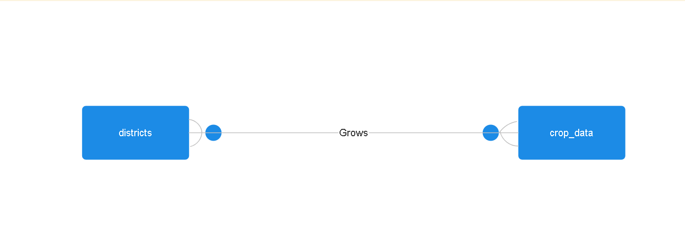

# Design Document
By Pratham Dusane

Video overview: https://youtu.be/NVtJPGMDS7o

# Comprehensive Design Document for District-Level Agricultural Database

## Introduction

The District-Level Agricultural Database is designed to centralize and analyze extensive agricultural data related to rice and wheat cultivation across diverse districts and states over multiple years. This document provides an in-depth exploration of the database's purpose, scope, entities, relationships, optimizations, potential limitations, and implications for agricultural management, research, and policy-making.

## Purpose

The District-Level Agricultural Database aims to:
- Facilitate Informed Decision-Making: By providing comprehensive data on cultivation metrics such as area, production, and yield per hectare for rice and wheat at the district level.
- Support Agricultural Research and Development: Enable researchers to analyze trends and patterns to enhance productivity and sustainability.
- Inform Policy Formulation: Assist policymakers in crafting effective agricultural policies based on empirical data and analysis of district-level agricultural performance.

## Scope

### Districts Entity
- **Dist_Code**: Unique identifier for each district.
- **State_Code**: Identifier linking each district to its respective state.
- **State_Name**: Name of the state.
- **Dist_Name**: Name of the district.

### Crop Data Entity
- **Year**: Specific year of the recorded data.
- **Rice_Area**: Area of land under rice cultivation (in 1000 hectares).
- **Rice_Production**: Total rice production (in 1000 tons).
- **Rice_Yield**: Yield of rice per hectare (in kilograms).
- **Wheat_Area**: Area of land under wheat cultivation (in 1000 hectares).
- **Wheat_Production**: Total wheat production (in 1000 tons).
- **Wheat_Yield**: Yield of wheat per hectare (in kilograms).

## Entities and Attributes

### Districts Entity

The **Districts** entity provides administrative and geographical details:
- **Dist_Code**: Unique identifier for each district.
- **State_Code**: Identifier linking each district to its respective state.
- **State_Name**: Name of the state.
- **Dist_Name**: Name of the district.

### Crop Data Entity

The **Crop Data** entity includes detailed metrics for rice and wheat cultivation:
- **Year**: Specific year of the recorded data.
- **Rice_Area**: Area of land under rice cultivation (in 1000 hectares).
- **Rice_Production**: Total rice production (in 1000 tons).
- **Rice_Yield**: Yield of rice per hectare (in kilograms).
- **Wheat_Area**: Area of land under wheat cultivation (in 1000 hectares).
- **Wheat_Production**: Total wheat production (in 1000 tons).
- **Wheat_Yield**: Yield of wheat per hectare (in kilograms).

## Relationships

### Many-to-Many Relationship

Each district can have multiple records over different years:
- **District-Year Relationship**: Captures variations in rice and wheat cultivation metrics over time.

### State-District Relationship

States are linked to districts:
- **State-District Relationship**: Facilitates data organization and analysis at district and state levels.

## Optimizations

### Indexes

- **State_Code Index**: Enhances data filtering by state.
- **Year Index**: Facilitates retrieval of temporal data trends.

### Normalization

Adheres to normalization principles for data integrity.

## Limitations

- **Crop Varieties**: Does not account for variations in crop varieties within rice or wheat.
- **Data Completeness**: Historical data completeness may vary across districts and years.

## Conclusion

The District-Level Agricultural Database serves as a vital resource for agricultural stakeholders, enabling informed decision-making, research, and policy formulation based on comprehensive district-level agricultural data.
